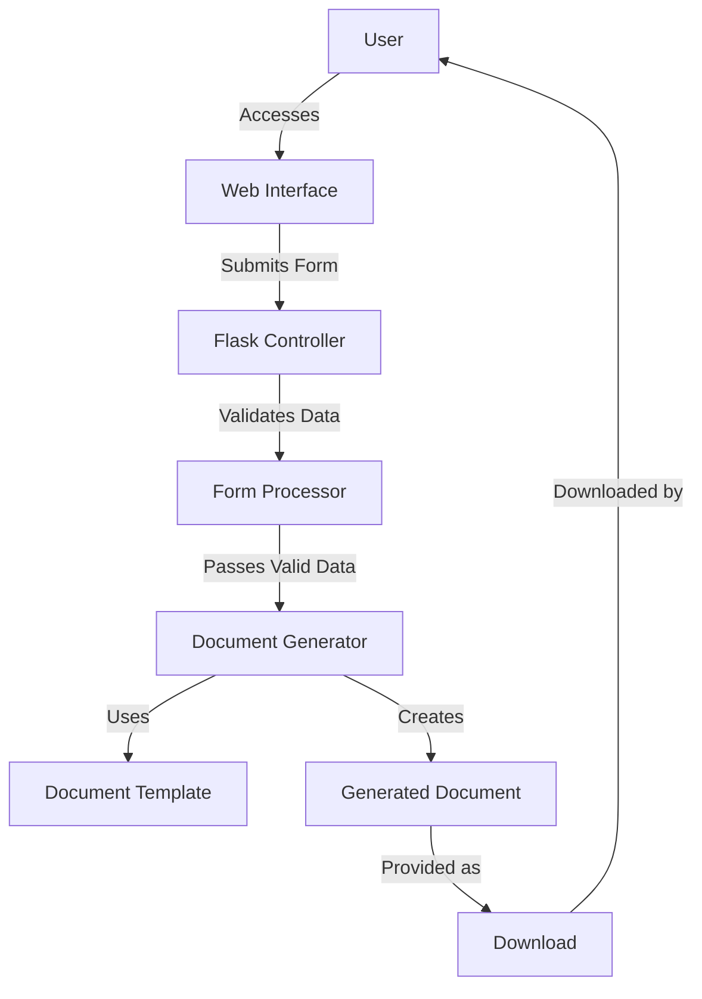
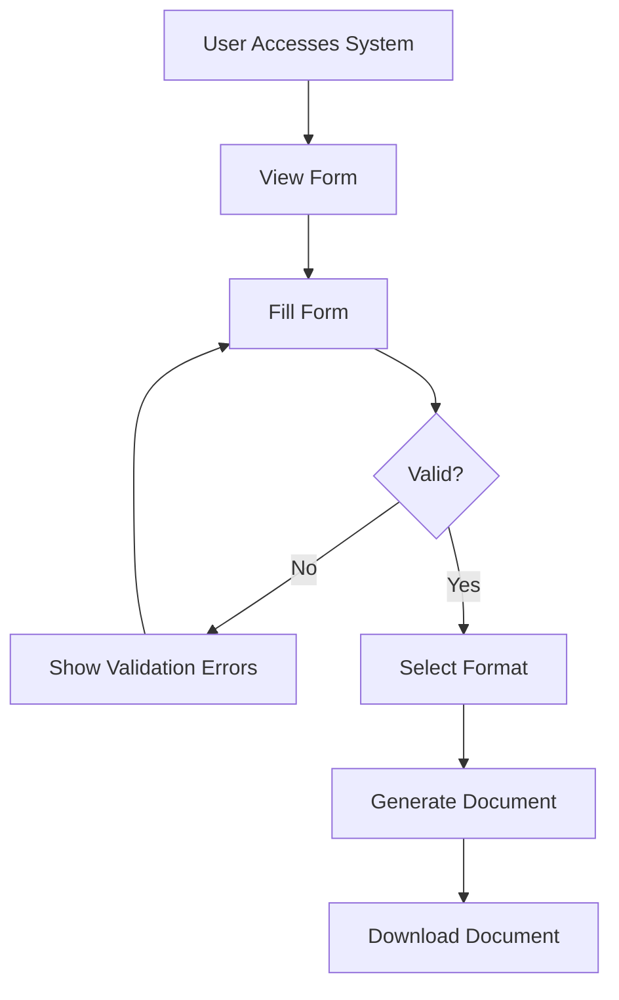

# Design Document: Procurement Document Generator

## Overview

The Procurement Document Generator is a web-based system that allows users to input procurement data through a form interface and automatically generates standardized government procurement documents in .docx or .pdf format. The system is designed to be stateless, requiring no database, with all processing done in-memory and documents provided for immediate download.

## Architecture

The system will follow a simple Model-View-Controller (MVC) architecture pattern:

1. **Model**: Handles data processing, validation, and document generation
2. **View**: Provides the user interface for data input and document download
3. **Controller**: Manages the flow between the user interface and the document generation process

The system will be built using:
- **Flask**: A lightweight Python web framework for handling HTTP requests and responses
- **Python-docx**: A Python library for creating and updating Microsoft Word (.docx) files
- **WeasyPrint** or **docx2pdf**: For converting .docx files to PDF format when requested
- **JavaScript/jQuery**: For client-side form validation and dynamic form elements
- **HTML/CSS**: For the user interface

### System Architecture Diagram



## Components and Interfaces

### 1. Web Interface (View)

The web interface will consist of:

- **Form Page**: HTML form with fields for all required procurement information
- **Result Page**: Page displaying download links for generated documents

#### Form Components:
- Input fields for procurement details (text inputs, dropdowns, date pickers)
- Dynamic form sections for adding multiple procurement items
- Client-side validation using JavaScript
- Form submission button
- Format selection (DOCX/PDF)

### 2. Controller

The controller will be implemented in Flask and will handle:

- Routing HTTP requests
- Processing form submissions
- Validating input data
- Initiating document generation
- Serving generated documents for download

### 3. Document Generator (Model)

The document generator will:

- Accept validated form data
- Load the appropriate document template
- Fill template placeholders with form data
- Format dates and numbers according to Thai government standards
- Generate the final document in the requested format
- Provide the document for download

## Data Models

Since the system is stateless with no database, we'll define data structures that will be used in-memory during processing:

### ProcurementData

```python
class ProcurementData:
    """Data structure to hold procurement form data."""
    
    def __init__(self):
        # Basic procurement information
        self.date = None  # Date in Buddhist Era
        self.requester_name = ""  # Name of who requests
        
        # Supply information
        self.supply_amount = 0  # Amount of supply
        
        # Cost information
        self.cost_number = 0.0  # Numeric cost
        self.cost_text_thai = ""  # Thai text representation of cost
        
        # Purpose information
        self.objective = ""  # Objective/purpose of procurement
        
        # Committee information (optional)
        self.committee_member1 = ""  # First committee member (if any)
        self.committee_member2 = ""  # Second committee member (if any)
        
        # Items to be procured
        self.items = []  # List of ProcurementItem objects
```

### ProcurementItem

```python
class ProcurementItem:
    """Data structure to hold information about each procurement item."""
    
    def __init__(self):
        self.item_number = 0
        self.description = ""
        self.quantity = 0
        self.unit = ""
        self.price_per_unit = 0.0
        self.total_price = 0.0
```

## Error Handling

The system will implement the following error handling strategies:

1. **Client-side Validation**:
   - Real-time validation of form fields
   - Prevention of form submission with invalid data
   - Clear error messages displayed next to problematic fields

2. **Server-side Validation**:
   - Secondary validation of all form data
   - Appropriate HTTP status codes for different error types
   - Descriptive error messages returned to the client

3. **Document Generation Errors**:
   - Exception handling for template processing errors
   - Fallback mechanisms for document generation failures
   - User-friendly error messages for technical issues

## Testing Strategy

The testing strategy will include:

1. **Unit Testing**:
   - Test individual components (form validation, data processing, document generation)
   - Verify correct handling of valid and invalid inputs
   - Ensure proper formatting of dates and numbers

2. **Integration Testing**:
   - Test the interaction between components
   - Verify end-to-end document generation process
   - Test different document formats (DOCX, PDF)

3. **User Interface Testing**:
   - Test form functionality and validation
   - Verify dynamic form elements (adding/removing items)
   - Test responsiveness and browser compatibility

## Technical Considerations

### Document Template Structure

The document template will use the following placeholder format for easy replacement:

- Text placeholders: `{{placeholder_name}}`
- Table row placeholders: Special markers for row repetition
- Date placeholders: `{{date}}` (will be formatted according to Thai standards)
- Number placeholders: `{{cost_number}}` (will be formatted according to Thai standards)
- Text cost placeholders: `{{cost_text_thai}}` (Thai text representation of the cost)

### Thai Language and Buddhist Era Support

- The system will support Thai language input and output
- Date conversion between Gregorian and Buddhist Era calendars
- Proper formatting of Thai numbers and currency
- Thai text representation of numerical values

### Security Considerations

- Input sanitization to prevent injection attacks
- CSRF protection for form submissions
- No persistent storage of sensitive data
- Temporary files cleaned up after document generation

## User Experience Design

### Form Layout

The form will be organized into logical sections:

1. **Basic Information**:
   - Date (with Buddhist Era calendar)
   - Requester name

2. **Supply Information**:
   - Amount of supply
   - Items details (if multiple items)

3. **Cost Information**:
   - Cost in numbers
   - Cost in Thai text

4. **Purpose Information**:
   - Objective of procurement

5. **Committee Information** (Optional):
   - Committee member 1
   - Committee member 2

### User Flow



## Thai Baht Text Conversion

A special utility will be implemented to convert numerical values to Thai text representation for official documents:

```python
def num_to_thai_text(number):
    """
    Convert a number to Thai text representation.
    For example: 1,234.56 -> หนึ่งพันสองร้อยสามสิบสี่บาทห้าสิบหกสตางค์
    """
    # Implementation will handle:
    # - Whole numbers to Thai text
    # - Decimal parts as satang
    # - Zero handling
    # - Large number handling
    pass
```

## Buddhist Era Date Conversion

The system will include a utility to convert Gregorian calendar dates to Buddhist Era dates:

```python
def gregorian_to_buddhist_era(date):
    """
    Convert a Gregorian calendar date to Buddhist Era date.
    Buddhist Era = Gregorian year + 543
    """
    # Implementation will handle:
    # - Year conversion (add 543)
    # - Proper Thai date formatting
    # - Thai month names
    pass
```